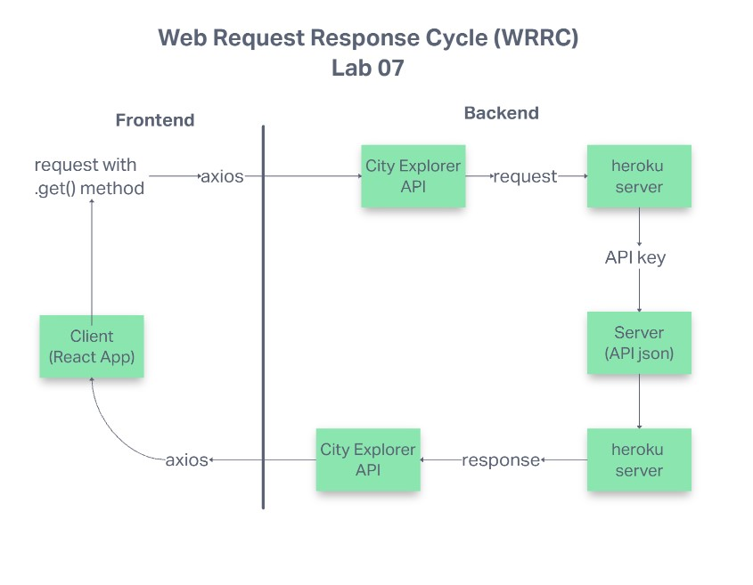

# city-explorer-api

**Author**: Robert Ball

**Version**: 1.0.0

## Overview

This repo is established to serve as a backend for all API requests from [city-explorer](https://github.com/RDBALL/city-explorer)

## Getting Started

This app will require the user to initialize a server with Heroku and point their deployed app to utilize user specific API tokens and their Heroku server.

## Architecture

This app utilizes NODE.js, JavaScript and json data to provide the user with requested data

## Change Log

<!-- Use this area to document the iterative changes made to your application as each feature is successfully implemented. Use time stamps. Here's an example:

01-01-2001 4:59pm - Application now has a fully-functional express server, with a GET route for the location resource. -->

## Credit and Collaborations
<!-- Give credit (and a link) to other people or resources that helped you build this application. -->

### Time Estimates

***For each of the lab features, make an estimate of the time it will take you to complete the feature, and record your start and finish times for that feature:***

## **Lab 07**

Name of feature: Establish back-end server capabilities by deploying this repo to Heroku

Estimate of time needed to complete: 2 hours

Start time: 1pm

Finish time: 4:30pm

Actual time needed to complete: 3.5 hours

---
